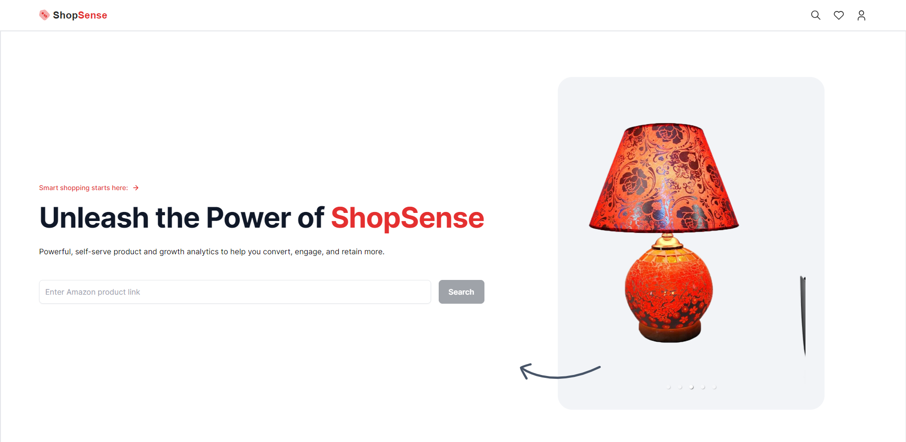
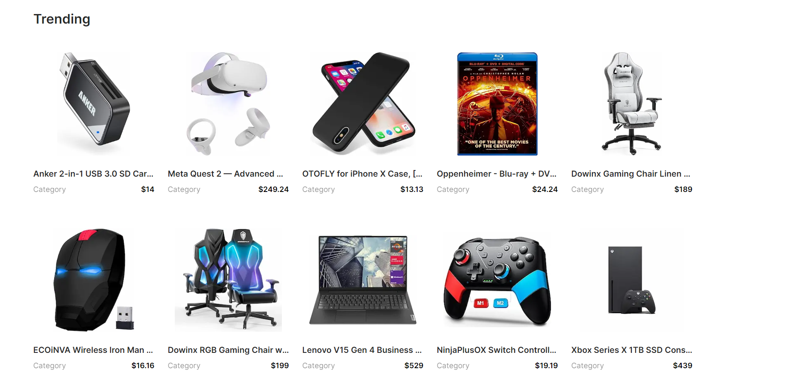
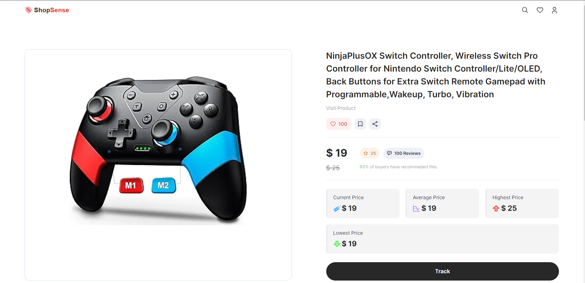
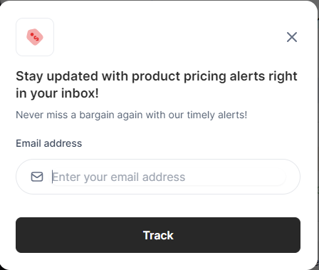
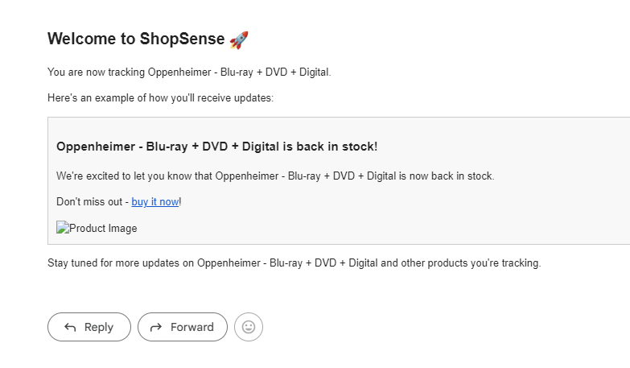

<div align="center"> 
 <h1 align="center">🛒 ShopSense<h1> 
  </a> <br /> <div>
    
   
  
  
  
  
</div>
 <h3 align="center">A Next.js 14-powered Price Tracking Platform</h3>
  <p align="center">Easily track product prices, receive timely notifications for significant events such as restocks and price drops, and manage your preferences seamlessly.</p> </div>

## Overview

The Next.js Price Tracker is a sophisticated web application designed to empower users with the ability to track product prices, receive timely notifications for significant events such as restocks and price drops, and manage their preferences seamlessly. This application serves as a centralized platform for users to monitor changes in product prices over time and make informed purchasing decisions.

### Key Features

1. **Product Tracking:**
   - Users can add product URLs to the application for continuous tracking.
   - The application periodically scrapes product information from supported e-commerce websites to ensure up-to-date data.

2. **Price History:**
   - The system maintains a detailed history of product prices, allowing users to visualize and analyze trends over time.
   - Historical data enables users to make informed decisions by identifying patterns and fluctuations.

3. **Notifications:**
   - Users receive real-time notifications for specific events, including product restocks, significant price drops, and other noteworthy changes.
   - Notifications are customizable, allowing users to tailor their preferences based on individual tracking needs.

4. **Email Notifications:**
   - The application integrates Nodemailer to send email notifications to users.
   - Users can receive personalized emails for welcome messages, restocks, lowest price alerts, and when a product surpasses a specified threshold.

5. **User-Friendly Interface:**
   - The web interface, built using Next.js , provides a smooth and intuitive user experience.
   - Users can easily navigate between product listings, view detailed product pages, and manage their tracking preferences.

## Technologies Used

The Next.js Price Tracker leverages a modern tech stack to deliver a robust and scalable solution:

- **Node.js:** The backend is developed using Node.js, providing a non-blocking, event-driven architecture.

- **Express.js:** The application uses Express.js as the web framework to handle HTTP requests and responses efficiently.

- **MongoDB:** A NoSQL database is employed to store product information and user preferences, with Mongoose serving as the ODM.

- **Nodemailer:** For email notifications, Nodemailer is utilized, offering a flexible and powerful solution for sending emails from Node.js applications.

- **Next.js:** The frontend benefits from the features of Next.js, a React framework that facilitates server-side rendering and static site generation.

## Project Structure

The project adheres to a structured organization, facilitating clarity and maintainability:

- **Server:**
  - `server.js`: The main server file initializing the Express application, connecting to MongoDB, and setting up API routes.
  - `mongoose.js`: Manages the MongoDB connection using Mongoose.
  - `nodemailer.js`: Configures and sends email notifications using Nodemailer.

- **Scraper:**
  - `scraper.js`: Contains functions to scrape product information from supported websites.

- **Models:**
  - `product.model.js`: Defines the MongoDB schema for the Product model.

- **Utils:**
  - `utils.js`: Hosts utility functions for calculating average, highest, and lowest prices.

- **Next.js Pages:**
  - `pages/index.js`: The main page where users can add and track products.
  - `pages/products/[id].js`: Displays detailed information about a tracked product.

## How to Run

1. **Clone the Repository:**
   ```bash
   git clone https://github.com/TheODDYSEY/ecommerce-price-tracker
   ```

2. **Install Dependencies:**
   ```bash
   npm install
   ```

3. **Set Up Environment Variables:**
   - Create a `.env` file in the root directory.
   - Define the following variables:
     ```dotenv
     MONGODB_URI=your_mongodb_connection_string
     EMAIL_ADDRESS=your_email_address
     EMAIL_PASSWORD=your_email_password
     ```

4. **Run the Application:**
   ```bash
   npm start
   ```

5. **Access the Application:**
   - Open your browser and visit `http://localhost:3000` to interact with the application.

## Contributors

The following contributors have played a significant role in shaping and enhancing the Next.js Price Tracker:

- [Your Name](https://github.com/TheODDYSEY)


## Acknowledgments

The project draws inspiration from the need for an efficient and user-friendly solution for tracking and receiving notifications about product price changes. Special thanks to the open-source community for providing invaluable tools and resources.

